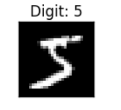

# Scale17x

This repository is for Scale17x conference and it contains deep learning starter programs.

## Concepts

1. Logistic Regression
2. Multilayer Perceptron
3. Convolutional Neural Network

_NOTE_ Notebook with name ending with `workshop` is for practise whereas solutions are provided in notebooks ending with the name `solution`.

## Goal

Create a deep learning model to classify hand-written MNIST dataset.

* A large database of handwritten digits (0 to 9). 
* The database contains 60,000 training images & 10,000 testing images. 
* Each image is of size 28x28. 

## Reference materials

1. [CNN for beginners](https://adeshpande3.github.io/A-Beginner%27s-Guide-To-Understanding-Convolutional-Neural-Networks/)
2. [History of neural network](http://dataconomy.com/2017/04/history-neural-networks/)
3. [CNN](https://towardsdatascience.com/applied-deep-learning-part-4-convolutional-neural-networks-584bc134c1e2)
4. [CNN - 1](http://cs231n.github.io/convolutional-networks/)
5. [CNN Intutive Guide](https://medium.freecodecamp.org/an-intuitive-guide-to-convolutional-neural-networks-260c2de0a050)
6. [Neural Network Visualization](https://www.youtube.com/watch?v=3JQ3hYko51Y)
7. [Logistic Regression](https://towardsdatascience.com/logistic-regression-detailed-overview-46c4da4303bc)
8. [CNN Parameter formula](https://stackoverflow.com/questions/42786717/how-to-calculate-the-number-of-parameters-for-convolutional-neural-network/42787467)
9. [What is deep learning](https://machinelearningmastery.com/what-is-deep-learning/)
10. [Softmax function](https://medium.com/data-science-bootcamp/understand-the-softmax-function-in-minutes-f3a59641e86d)
11. [Activation](http://adilmoujahid.com/posts/2016/06/introduction-deep-learning-python-caffe/)
12. [IBM Deep Learning Article](https://www.ibm.com/blogs/systems/deep-learning-performance-breakthrough/)
13. [Multi-Layer Perceptron](http://deeplearning.net/tutorial/mlp.html)
14. [Keras](https://keras.io/)
